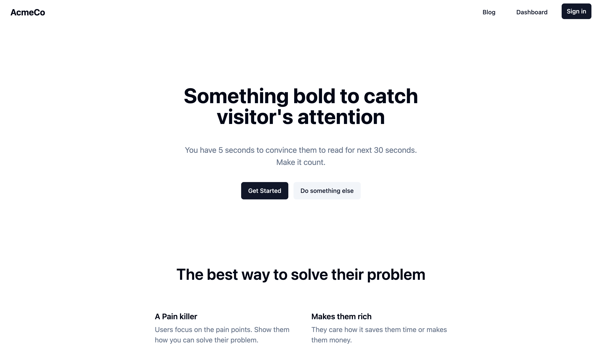

# SaasKitten - Open Source SvelteKit SaaS Starter Kit

This is a SaaS starter kit built with SvelteKit and TailwindCSS. It is designed to be a starting point for building a SaaS application (fast).

Tired of paid SaaS starter kits everywhere? Me too 😅.

**Note:** This was meant to be a paid product but I decided to make it open source as I don't have time to work on it.

PRs are welcome 🙏

If you find it useful please give it a star ⭐.

## Features

- [x] 🪪 Authentication with Lucia
- [x] 💾 Use any database (Thanks to Prisma)
- [x] 🎨 Marketing UI with TailwindCSS (landing page, pricing page, etc.)
- [x] UI with chadcn-svelte
- [ ] 💳 Payments with LemonSqueezy (wip)
- [ ] 💳 Payments with Stripe
- [x] 🔍 SEO friendly
- [x] 📝 Blog with mdsvex
- [x] 💌 Emails with any email service provider
- [ ] ⚙️ Billing settings
- [ ] 📑 Docs
- [ ] ⚡AI Integration with OpenAI
- [ ] 👷 Monorepo setup for docs



## Developing

Once you've created a project and installed dependencies with `npm install` (or `pnpm install` or `yarn`):

- set up environment variables

```bash
cp .env.example .env
```

- migrate the database

```bash
npm run migrate:dev
```

- start the dev server

```bash
npm run dev

# or start the server and open the app in a new browser tab
npm run dev -- --open
```

## app structure

```
src
├── content (mdsvex content)
├── lib (app configurations and shared logic)
│   ├── components
│   │   ├── analytics (Google Analytics)
│   │   ├── marketing (landing page components)
│   │   └── ui (shadcn-svelte components)
│   └── server (Db, email, auth and other server side logic)
└── routes
    ├── (app)
    │   ├── auth
    │   │   ├── email-verification
    │   │   ├── login
    │   │   ├── password-reset
    │   │   └── signup
    │   └── dashboard (main app)
    └── (marketing)
        └── blog (blogs from content)
```

## Configure your app

Most important configurations are in the `src/lib/appConfig.ts` file.
You can change the app name, description, pricing and other configurations there.

## Building

To create a production version of your app:

```bash
npm run build
```

You can preview the production build with `npm run preview`.

> To deploy your app, you may need to install an [adapter](https://kit.svelte.dev/docs/adapters) for your target environment.

## Deployment

You can deploy your app with Vercel, Netlify, or any other hosting provider that supports Node.js.

Setup your environment variables in your hosting provider according to the `.env.example` file.

## Contributing

This is a community project and I would love to see it grow.
Not everyone can afford paid starter kits and I believe this project can help a lot of people.

If you have any ideas on how to improve this project, feel free to open an issue or submit a PR even if it's just a typo fix.

## License

MIT
